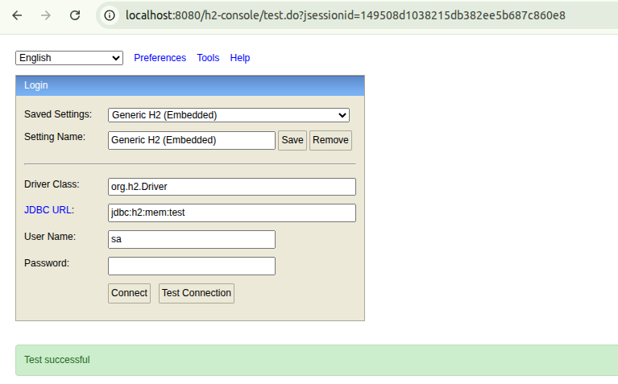
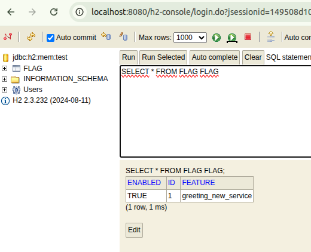

# Spring Boot Flowed Routing — Simple Demo

## Introduction

This demo shows a simple use case using an H2 in-memory database with a flagged feature.

| feature               | enabled |
|-----------------------|---------|
| greeting_new_service  | true    |

## Code

### 1. Create the repository with the query

```java
@Repository
public interface FlagRepository extends JpaRepository<Flag, Long> {

	@Query("SELECT f.enabled FROM Flag f WHERE f.feature = ?1")
	Boolean isFlagEnabled(String flagName);
}
```

### 2. Create the component that uses the repository

```java
@Component
@AllArgsConstructor
public class FlagService {
	FlagRepository flagRepository;

	public boolean isFlagActive(String flagName) {
		return flagRepository.isFlagEnabled(flagName);
	}
}
```

### 3. Enable or disable your `@RoutedComponent` based on the database flag

```java
@RoutedComponent
public class NewGreetingService implements GreetingService {

	@FlowConditionType("SpEL") // Use default evaluator provided in the starter (SpEL)
	@FlowSpelCondition(evaluationExpression = "@flagService.isFlagActive('greeting_new_service')")
	@Override
	public String greeting(String userName) {
		return "You are amazing " + userName + " because you are using the NEW Greeting Service";
	}
}
```

# How to Run

Simply run Spring Boot:

```sh
mvn clean install spring-boot:run
```

# H2 Database

H2 console is available at:  
http://localhost:8080/h2-console

**JDBC URL:** `jdbc:h2:mem:test`



A table called **FLAG** will be created with the configured feature flag:



# Test

The execution of `NewGreetingService` is enabled because the flag value is set to **true**:

```java
@FlowConditionType("SpEL")
@FlowSpelCondition(evaluationExpression = "@flagService.isFlagActive('greeting_new_service')")
@Override
public String greeting(String userName) {
	return "You are amazing " + userName + " because you are using the NEW Greeting Service";
}
```

Invoke the Greeting controller:

```sh
curl --location --request GET 'http://localhost:8080/greeting?userName=Anthony'
You are amazing Anthony because you are using the NEW Greeting Service
```

Update the flag value to *false* using the H2 web console:

```sql
UPDATE FLAG SET enabled = false WHERE feature = 'greeting_new_service';
```

Retry the same request. Now the **DefaultGreetingService** will run:

```sh
curl --location --request GET 'http://localhost:8080/greeting?userName=Anthony'
Greetings for Anthony
```
